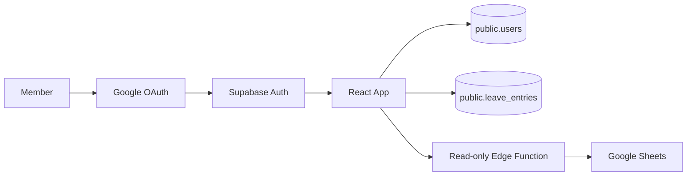
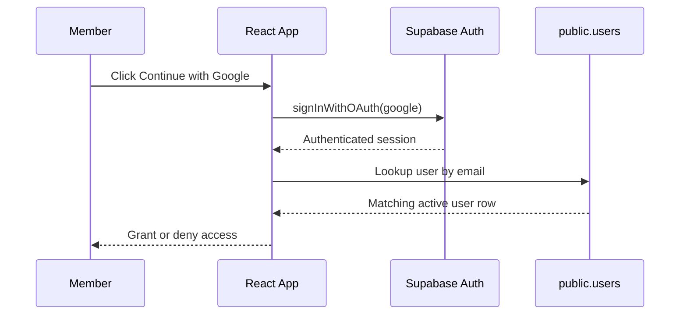
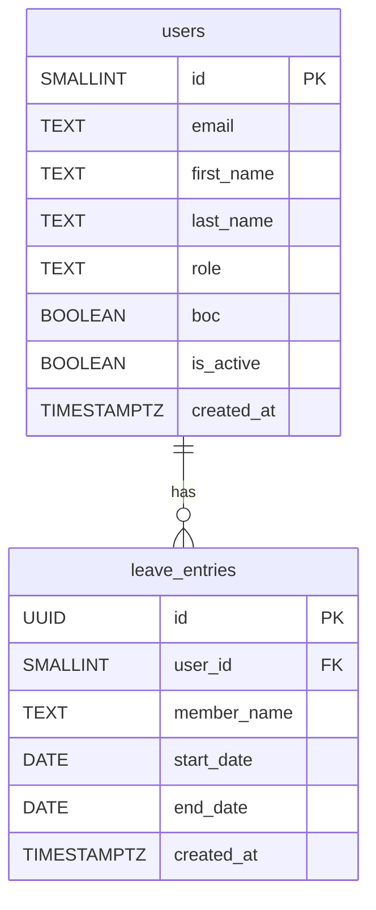

# Errolian Club

A private members application for the Errolian Club, built with React, Vite, Tailwind, and Supabase.

The project is deliberately simple in structure but production-minded in approach:

- Google sign-in through Supabase Auth
- access controlled by the existing `public.users` table
- leave management stored in Supabase Postgres
- Google Sheets retained only for read-only use where needed
- fast deployment via Vercel

## Overview

The application is designed around a straightforward rule: members authenticate with Google, and only approved users in the database are allowed through the gate.

Once signed in, members enter a lightweight portal with three core areas:

- `Home`
- `Calendar`
- `Expenses`

At the moment, the `Calendar` page is the most complete feature. It reads leave entries from Supabase, renders a month view, shows upcoming leave across the club, and allows members to add and delete their own leave entries.

## Product Goals

This codebase is aiming for a balance that is common in strong internal products and operational tools:

- simple enough to maintain without ceremony
- clean enough to scale without rewrite panic
- explicit enough to onboard someone new quickly
- robust enough for real-world member usage

In practice, that means:

- minimal routing complexity
- small number of components
- clear data ownership
- no spreadsheet-style write workflows for core app data

## Architecture

### High Level



### Access Flow



### Data Model



## Technology Stack

### Frontend

- React 19
- TypeScript
- Vite
- Tailwind CSS v4

### Backend Services

- Supabase Auth for Google login
- Supabase Postgres for application data
- Supabase Edge Functions for read-only Google Sheets access

### Deployment

- Vercel for frontend hosting
- Supabase for auth, database, and functions

## Repository Structure

```text
src/
  components/
    AccessPanel.tsx
    CalendarPage.tsx
    ExpensesPage.tsx
    Footer.tsx
    Header.tsx
    HomePage.tsx
    LoadingScreen.tsx
  lib/
    leave.ts
    supabase.ts
  App.tsx
  index.css
  main.tsx
```

## Core Features

### 1. Authentication

Members sign in using Google through Supabase Auth.

The app then checks the existing `public.users` table and only allows access when:

- the email exists in `public.users`
- `is_active = true`

This avoids the need for a custom auth backend while keeping membership control in your own database.

### 2. Members-Only Navigation

After approval, members see a small portal shell with:

- header navigation
- member name and role in the header
- sign-out action
- page-aware URL paths

Current paths:

- `/`
- `/calendar`
- `/expenses`

### 3. Leave Calendar

The leave calendar is now backed by Supabase, not Google Sheets.

It supports:

- full leave register loading from `public.leave_entries`
- month view with quiet daily counts
- selected-day detail panel
- upcoming leave across the club
- add leave
- delete leave
- current member leave and leave history panels

### 4. Read-Only Google Sheets Integration

Google Sheets is no longer used as the write source for leave.

That was intentionally retired because a spreadsheet is not a reliable transactional store for app CRUD.

The remaining strategy is:

- Supabase for owned application data
- Google Sheets only for read-only integrations where useful

## Database

### Existing `public.users` Table

The app assumes the `public.users` table already exists.

Current expected shape:

| column | type | purpose |
| --- | --- | --- |
| `id` | `int2` | internal member id |
| `email` | `text` | used for membership lookup after Google sign-in |
| `first_name` | `text` | display |
| `last_name` | `text` | display |
| `role` | `text` | display |
| `boc` | `boolean` | special permission flag |
| `is_active` | `boolean` | access gate |
| `created_at` | `timestamptz` | audit metadata |

### `public.leave_entries` Table

Current app code expects the following schema:

```sql
create extension if not exists pgcrypto;

create table if not exists public.leave_entries (
  id uuid primary key default gen_random_uuid(),
  user_id int2 not null references public.users(id) on delete cascade,
  member_name text not null,
  start_date date not null,
  end_date date not null,
  created_at timestamptz not null default now(),
  constraint leave_entries_date_order check (start_date <= end_date)
);
```

### Minimal RLS Policies For Current Leave Feature

The current frontend code works with this lean policy set:

```sql
alter table public.leave_entries enable row level security;

create policy "leave_entries_read"
on public.leave_entries
for select
to authenticated
using (true);

create policy "leave_entries_insert"
on public.leave_entries
for insert
to authenticated
with check (true);

create policy "leave_entries_delete"
on public.leave_entries
for delete
to authenticated
using (true);
```

This is intentionally simple for initial rollout.

A later hardening step would restrict insert/delete to a member's own `user_id`.

### Seed Existing Leave Data

If you are migrating the existing club leave from Sheets into Supabase, this works against the current schema:

```sql
insert into public.leave_entries (user_id, member_name, start_date, end_date)
values
  (1, 'Patrick Montgomery', '2025-12-24', '2026-01-03'),
  (1, 'Patrick Montgomery', '2025-07-08', '2025-07-11'),
  (4, 'Daniel Corrigan', '2025-07-08', '2025-07-12'),
  (4, 'Daniel Corrigan', '2025-10-17', '2025-10-17'),
  (4, 'Daniel Corrigan', '2025-11-20', '2025-11-22'),
  (3, 'Callum Forsyth', '2025-08-09', '2025-08-12'),
  (3, 'Callum Forsyth', '2025-08-29', '2025-08-29'),
  (3, 'Callum Forsyth', '2025-10-04', '2025-10-05'),
  (3, 'Callum Forsyth', '2025-10-11', '2025-10-19'),
  (3, 'Callum Forsyth', '2025-11-20', '2025-11-23'),
  (3, 'Callum Forsyth', '2025-12-02', '2025-12-04'),
  (3, 'Callum Forsyth', '2025-12-20', '2025-12-31'),
  (3, 'Callum Forsyth', '2026-01-17', '2026-01-18'),
  (3, 'Callum Forsyth', '2026-02-23', '2026-03-08'),
  (3, 'Callum Forsyth', '2026-06-19', '2026-06-21'),
  (3, 'Callum Forsyth', '2026-07-02', '2026-07-06'),
  (3, 'Callum Forsyth', '2026-07-09', '2026-07-12'),
  (2, 'Andrew Corlett', '2025-12-18', '2026-02-06'),
  (2, 'Andrew Corlett', '2026-03-16', '2026-04-30'),
  (3, 'Callum Forsyth', '2026-02-14', '2026-02-22'),
  (3, 'Callum Forsyth', '2026-04-04', '2026-04-19'),
  (1, 'Patrick Montgomery', '2026-04-17', '2026-04-19'),
  (1, 'Patrick Montgomery', '2026-05-01', '2026-05-03'),
  (1, 'Patrick Montgomery', '2026-04-22', '2026-04-23');
```

## Environment Variables

This project expects a local `.env` file with:

```bash
VITE_SUPABASE_URL=https://your-project.supabase.co
VITE_SUPABASE_ANON_KEY=your-anon-key
```

These are consumed in [src/lib/supabase.ts](/Users/patrickmontgomery/Documents/Main%20Code/errolian-club/src/lib/supabase.ts).

## Local Development

Install dependencies:

```bash
npm install
```

Start the development server:

```bash
npm run dev
```

Create a production build locally:

```bash
npm run build
```

Preview the production build:

```bash
npm run preview
```

## Authentication Setup

### Google Provider In Supabase

In Supabase:

1. Go to `Authentication` → `Providers` → `Google`
2. Enable Google
3. Add your Google OAuth client ID
4. Add your Google OAuth client secret

### URL Configuration

In Supabase Auth URL settings, include:

- `http://localhost:5173/**`
- `https://your-project.vercel.app/**`

If you use preview deployments on Vercel, also add the appropriate preview pattern.

## Deployment

### Vercel

Recommended path:

1. Push the repository to GitHub
2. Import the project into Vercel
3. Add the required environment variables in Vercel
4. Deploy
5. Add the Vercel URL to Supabase Auth redirect URLs

### Why Vercel

Vercel is a good fit here because:

- Vite is supported directly
- frontend deployment is very fast
- the free tier is enough for this stage
- Supabase continues to own auth and data

## Operational Approach Going Forward

The current architectural boundary is intentional:

### Use Supabase for

- member access
- leave entries
- expenses
- any user-generated or application-owned data

### Use Google Sheets for

- reference material
- shared reporting
- imported read-only operational data

That separation keeps the app reliable without adding unnecessary backend complexity.

## Current Limitations

The current code is deliberately small, which means some follow-up work is still sensible:

- leave policies can be tightened so users can only create and delete their own rows
- `member_name` in `leave_entries` is currently duplicated for convenience and can be normalised later
- `Expenses` is still a stub page
- broader admin workflows are still to come

## Quality Bar

This repository is trying to stay on the right side of both extremes:

- not overbuilt
- not improvised

The goal is a codebase that a small technical team can operate confidently, extend deliberately, and deploy cheaply.

## Commands

```bash
npm run dev
npm run build
npm run preview
npm run lint
```

## License

Private project.
